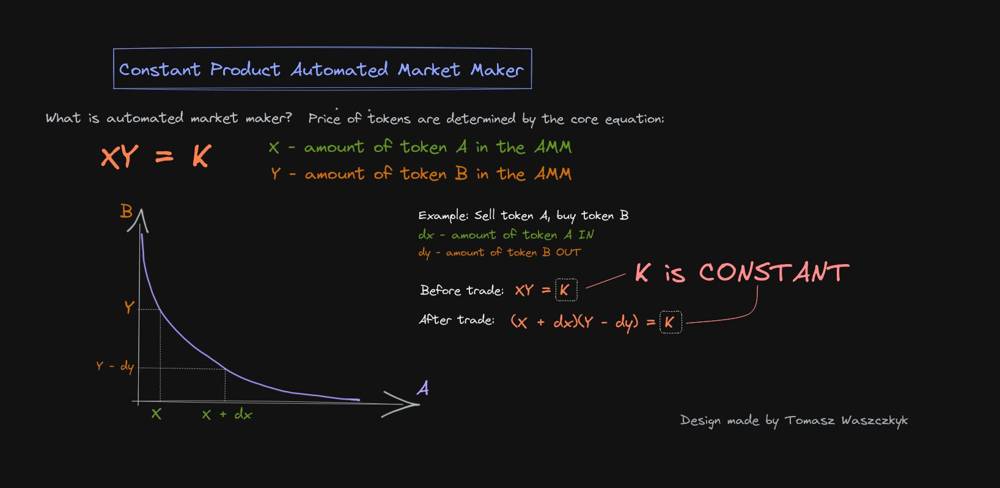

[](https://github.com/paritytech/ink)

```rust
 __          __      _____ __  __       ______ _____ _____   _____ _______       _____  ________   __
 \ \        / /\    / ____|  \/  |     |  ____|_   _|  __ \ / ____|__   __|     |  __ \|  ____\ \ / /
  \ \  /\  / /  \  | (___ | \  / |     | |__    | | | |__) | (___    | |        | |  | | |__   \ V / 
   \ \/  \/ / /\ \  \___ \| |\/| |     |  __|   | | |  _  / \___ \   | |        | |  | |  __|   > <  
    \  /\  / ____ \ ____) | |  | |     | |     _| |_| | \ \ ____) |  | |        | |__| | |____ / . \ 
     \/  \/_/    \_\_____/|_|  |_|     |_|    |_____|_|  \_\_____/   |_|        |_____/|______/_/ \_\
                                                                                                     
                                                                                                     
```
# :dizzy: Building WebAssembly-first Decentralized Exchange :dizzy:



# Building smart contract

`cargo +nightly contract build --release`

# Frontend

WIP
